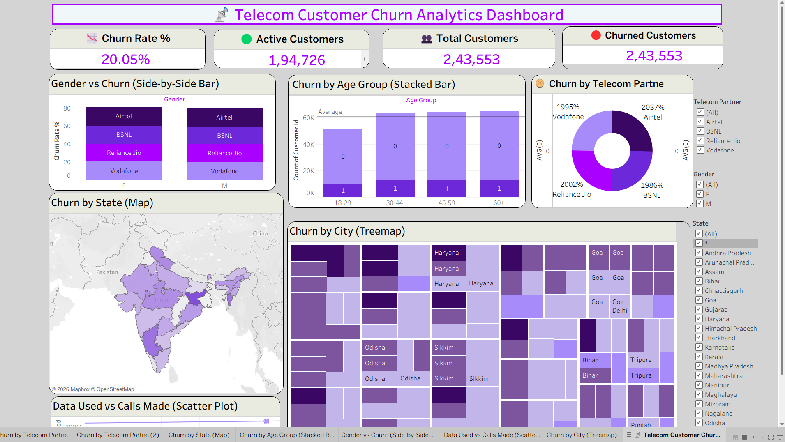

Telecom Customer Churn Analytics Dashboard

This Tableau dashboard project analyzes telecom customer churn trends using interactive visualizations. The dashboard helps businesses understand customer behavior, churn patterns, demographics, and telecom partner performance.

📊 Project Overview
The Telecom Customer Churn Analytics Dashboard provides insights into customer churn rate, active customers, total customers, age group analysis, telecom partner analysis, state-wise churn, city-wise churn, and customer usage patterns.

✨ Dashboard Features

• Churn Rate KPI

•Active Customers Analysis

•Total Customers Overview

•Gender vs Churn Comparison

• Age Group Churn Analysis

•Telecom Partner Churn Distribution

•State-wise Churn Map

•City-wise Treemap Analysis

•Data Usage vs Calls Made Scatter Plot

•Interactive Filters for Gender, State, and Telecom Partner

🛠 Tools & Technologies Used

•Tableau

•Data Visualization

•Dashboard Design

•Data Analytics

📷 Dashboard Screenshot

 
📈 Key Insights

1.Customer churn rate is approximately 20%.

2.Telecom partners show varying churn percentages.

3.Age groups 30-44 and 45-59 have higher customer counts.

4.Certain states and cities show higher churn intensity.

5.Customer usage patterns can help identify churn behavior.

🚀 Purpose of the Project

This project was created to practice Tableau dashboard develop

ment and data storytelling skills. It demonstrates the use of charts, maps, KPIs, filters, and interactive analytics for business decision-making.
👨‍💻 Author
Created by Uday Kakad

"Certain materials, including logos and images, 
are included in this educational data analytics 
dashboard under the fair use provision of the Indian Copyright Act, 1957. 
These materials are used strictly for educational, non-commercial purposes. 
All copyrights and trademarks remain the property of their respective owners."

